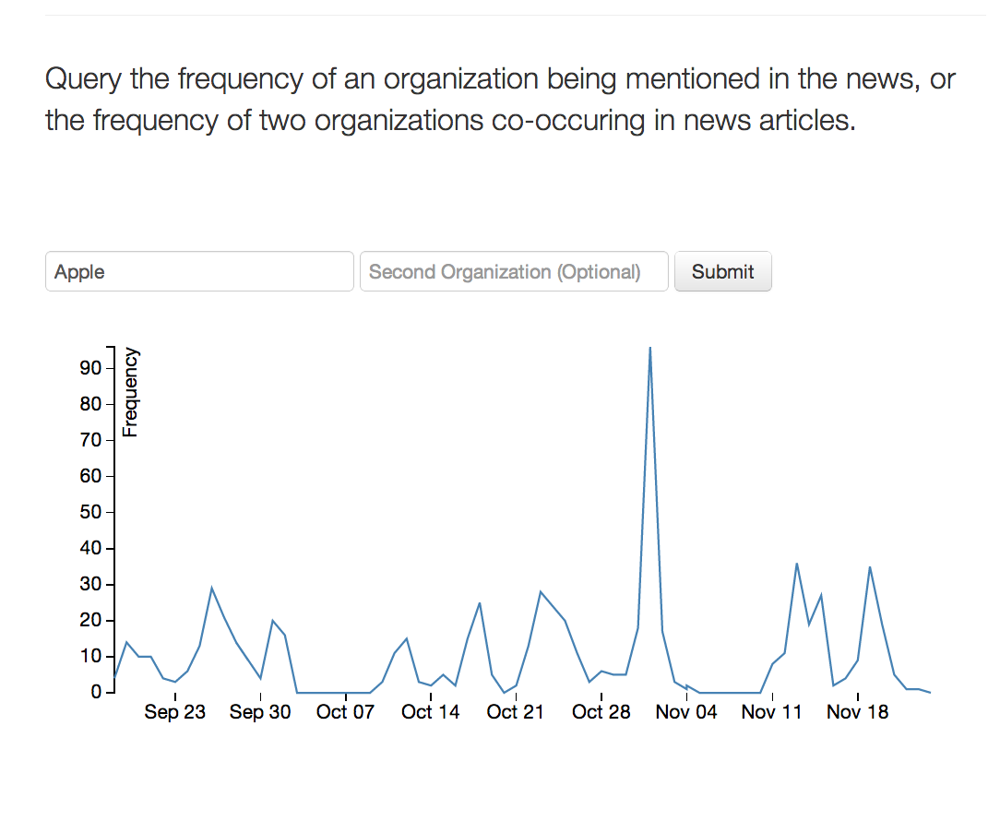

% Efficient, Composable, and Distributed Named Entity Counting
% Brian Martin

# Introduction

The basic goal of this system is to accurately pre-compute the number of mentions
of every organization across all input news documents without knowing which
organizations the user may later query. Moreover, the system is also able to
count all co-occurences of pairs of organizations within the same document
across the entire set of input documents.

These counts are sharded across durations of time. This allows for querying
each period of time for a frequency of an organization. The system provides
access to these time-series in response to queries and also has a frontend
webpage which takes queries, retrieves the time-series and plots frequency in
the client browser.

# Motivation

The goals fulfilled by this
system are important for many important tasks which may be of use to
businesses, individuals, and other entities. This system fulfills several
different use cases:

  - Arbitrary input of organizations or pairs of organizations yields
    pre-computed, accurate counts of how those organizations are trending in
    the news.
  - The input data source allows for a very broad picture across many news
    outlets. This is a more principled way to identify more broad trends versus
    simply checking a small list of news sources.
  - This system allows for comparative studies of a group of organizations via
    querying for each organization separately.

While many of these tasks would of course require some extra polishing and
convenience features, the main architecture is scalable and extensible to each
of these motivations.

# Architecture

The system architecture (Figure 1) takes advantage of the inherent sharding of the
documents over time. Time is a very natural way to divide the work of
ingesting, processing, and counting for all documents.

The architecture first produces a list of time durations which will form the
most basic units of work. Each worker then queries the document database for
all English language news articles which were published in that time duration.

Each worker then extracts organizations from each of the retrieved articles and
counts all organizations and all pairs of organizations in each document using
a Count-min sketch.

Finally, those sketches may be aggregated to an appropriate granularity (in my
trials, aggregating from a one-hour granularity to a one-day granularity).


## Organization Extraction

To extract organizations from articles, I use a popular and open-source NLP
toolkit, OpenNLP, to construct of pipeline consisting of: 

  1) Segmenting the document into sentences.
  2) Segmenting those sentences into words.
  3) Running a classifier over all tokenized sentences to retrieve organization
     spans.

## Count-min

At the heart of the system is an extremely efficient and accurate data
structure for tracking counts, the Count-min sketch of
@cormode2005an-improved-dat. The main idea behind this sketch is that as more
and more hash functions are used, it becomes less and less likely that for any
pair of objects all of those hash functions will collide.

### Data Structure

The structure of the count-min sketch is specified by a height and a width. The
height corresponds to the number of hash functions being used. The width
corresponds to the size of the domain of each hash function.

To add an item to the sketch, we may simply hash that item into one cell of
each row and increment the counter at each of those cells.

### Sketch Composition

A great advantage of the count-min sketch, which the architecture of this
project takes advantage of, is that sketches are easily composable. There are
a few caveats: 1) the sketches must have used the same hash functions, 2) the
sketches must be of the same size.

These conditions are easily ensured because the height and width are fully
specified a priori and the hash functions are produced from a family of hash
functions which only require a single number to specify. Therefore, to produce
the same hash functions across machines with no coordination, we can simply give
each worker the same random seed for choosing hash functions from the hash
family.

In my implementation, I use the Murmur3 hash. A non-cryptographically secure
hash family which has especially uniform distribution over the domain.

# Performance

I tested the system using 10 machines (single core of each) and restricted the
articles to those published in the first 15 minutes of each hour. This was
effectively a way to subsample the articles (at ratio 1/4). Processing quarter
the articles with a single core of 10 machines proceeded at 1 week of articles
per hour of processing time.

# Graceful degradation

If resources are limited, then the time duration may be increased. That is, at
a one-hour level of granularity a sketch is required for every hour.  Each
sketch, for my choice of width and depth, is approximately 350Kb. Therefore,
each day at a one-hour granularity requires ~10Mb. This is perfectly scalable
storage cost, as a whole year at this one-hour granularity would only consume
~3.5Gb. This is certainly small enough to be loaded into memory by a
reasonably-sized frontend server.

In my implementation of the system, sketches have constant size regardless of
time granularity. I found that a one-hour window seemed to be a good task size
(that is, it allows for batch document retrieval without overloading the
document server).

# Frontend

The frontend of the system includes two components: a REST server which loads
and serves queries on the sketches, and a more casual user-facing frontend
webpage which calls the REST server and produces line plots of the output (i.e.
frequency over time).

## REST Server

This server accepts HTTP queries encoded in the URL of the request. For
example, to query for the counts over time for the organization "Apple," one
can use the standard UNIX tool ``curl`` to make an HTTP request to the server:

```
$ curl -XGET http://hostserver.com/query/Apple
```

To make a query over co-ocurring organizations, for example "Apple" and
"Samsung":

```
$ curl -XGET http://hostserver.com/query/Apple/Samsung
```

## Webpage Frontend

The web-based frontend has a simple interface which allows the user to
interactively query the system in real-time. It then sends a request to the
REST server and plots the response. A screenshot of the interface is shown
in Figure 2.



# Limitations

## English Only

The current system only ingests English language articles. With the right NLP
tools, it is certainly possible to use the existing architecture on any
language. Whether named entity extraction performance would be acceptable for
an arbitrary language is less certain.

## Lack of Organization Canonicalization

The current system does not alter the organization strings from how they appear
in the article. This allows for the chance that something like differing case
in the query and the underlying mention could keep the user from getting the
most valuable results. One thing to explore would be some sort of
canonicalization mentions -- lowercasing, removing punctuation, expanding
abbreviations like "Inc.", etc.


# References
